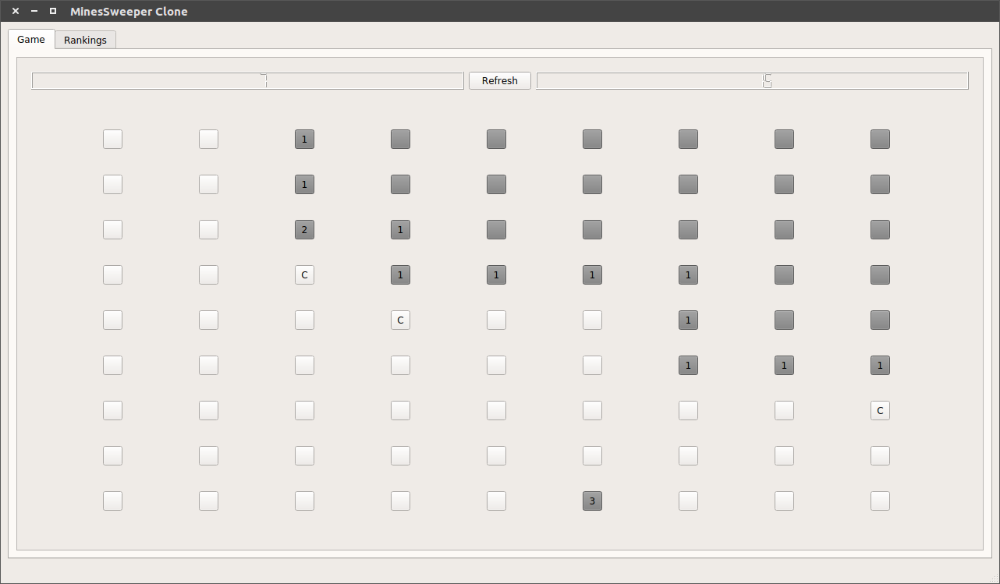
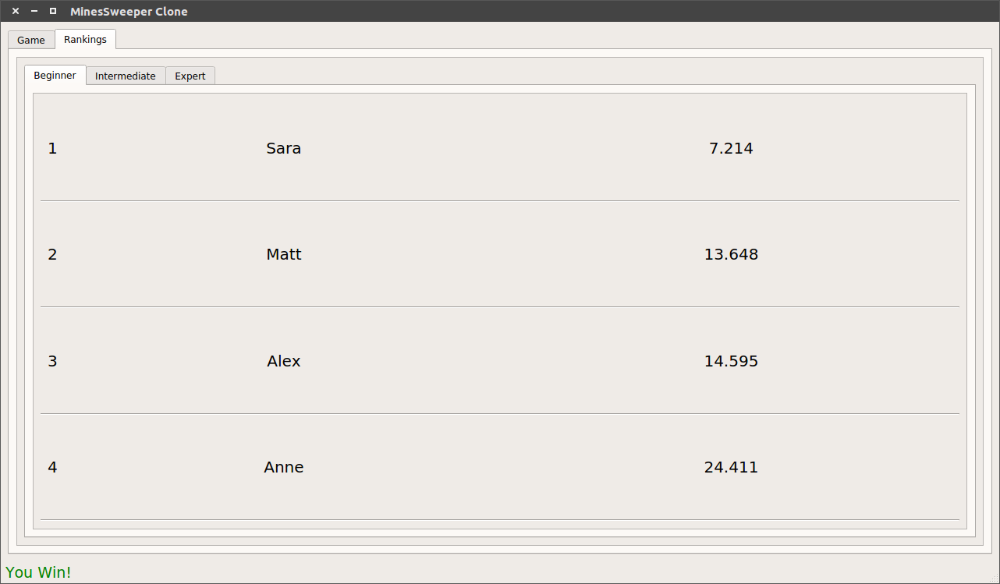

# HCI Project-MinesweeperClone
### A Minesweeper game created through Pyqt5.

##### Objective of the project

The project objective is the reproduction of the famous Minesweeper game, using Pyqt5.
Below the functions provided by the application are described.

##### Functions

- The game: the application provides the game grid. If a button which is a mine is clicked, the user looses the game. On the contrary, if all the non clicked buttons are mines the user wins. There is also the possibility to check a button if the user think that it is a mine.

- Refresh Button: if the user wants to start another match with the same grid characteristics, he can press the refresh button.

- Create a new game: the user can create a new game with different grid characteristics: he can choose between three difficulty type (Beginner, Intermediate, Expert) or he can create a personal grid through the Custom mode.

- Save, load or delete the games: the user can save a match in progress, load a saved game or delete some unnecessary saved ones every time he wants.

- Rankings: for the three difficulty type (Beginner, Intermediate, Expert) there are the rankings (one for each type). Only the first 20 best times are shown in each ranking. If the user does a new record, the application leads the user to insert his name in the rigth ranking.

- Autosave: a game in progress is saved every five seconds or after clicking a grid button.

##### Packages Installation

The needed packages to play this Minesweeper game are:

- PYTHON (Recommended Version: 3.6.6)
- PYQT (Recommended Version : 5.9.2) 

##### Important notes

The Operating System used for the project development is Ubuntu. If you want to use the application on an other Operating System(like Windows), you need to modify the files path in the project code: the inserting path policies are different depending on the used Operating System.

##### Images Example

###### The game grid

###### The game rankings

